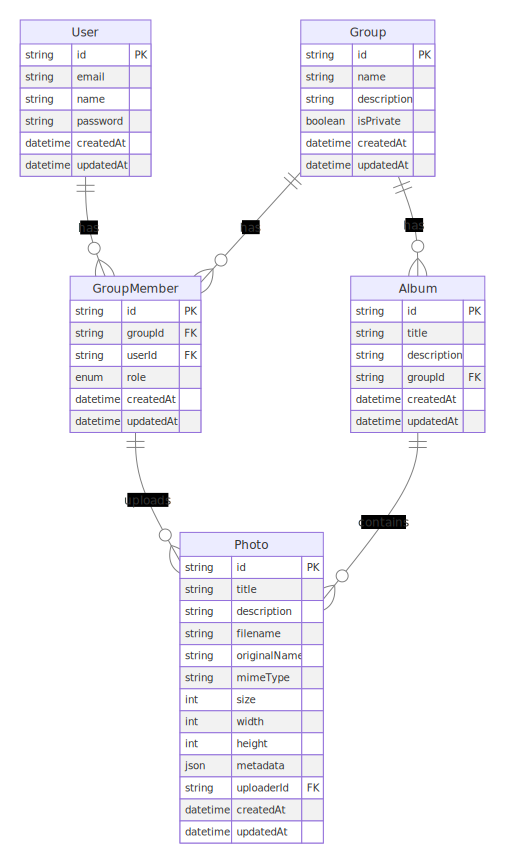

# データベース設計

## ER図

Mermaidソースは[こちら](./diagrams/er.mmd)にあります。

## 概要

写真管理アプリケーションのデータベース設計です。すべての写真はグループに属し、ユーザーはグループのメンバーとして写真を管理します。各ユーザーは自動的にプライベートグループを持ち、個人の写真管理にも利用できます。

## 主な関係性

1. User - GroupMember
   - 1人のユーザーは複数のグループのメンバーになれる
   - グループメンバーシップは必ずユーザーに紐づく
   - ユーザー作成時に自動的にプライベートグループのメンバーとなる

2. Group - GroupMember
   - 1つのグループは複数のメンバーを持てる
   - グループメンバーシップは必ずグループに紐づく
   - isPrivateフラグにより、個人用のプライベートグループと共有用のグループを区別

3. Group - Album
   - 1つのグループは複数のアルバムを持てる
   - アルバムは必ず1つのグループに属する
   - プライベートグループでも共有グループでも同じようにアルバムを作成可能

4. GroupMember - Photo
   - グループメンバーは複数の写真をアップロードできる
   - 写真は必ず1人のアップロード者（GroupMember）に紐づく
   - アップロード者の権限はGroupMemberのroleによって管理

5. Album - Photo
   - 1つのアルバムは複数の写真を含むことができる
   - 1つの写真は複数のアルバムに属することができる
   - アルバム内の写真はすべて同じグループに属する

## アクセス制御

- グループメンバーは3つの権限レベルを持つ
  - ADMIN: グループの管理、メンバー管理が可能
  - MEMBER: 写真のアップロード、アルバム作成が可能
  - VIEWER: 写真とアルバムの閲覧のみ可能
- プライベートグループでは、作成者が自動的にADMIN権限を持つ