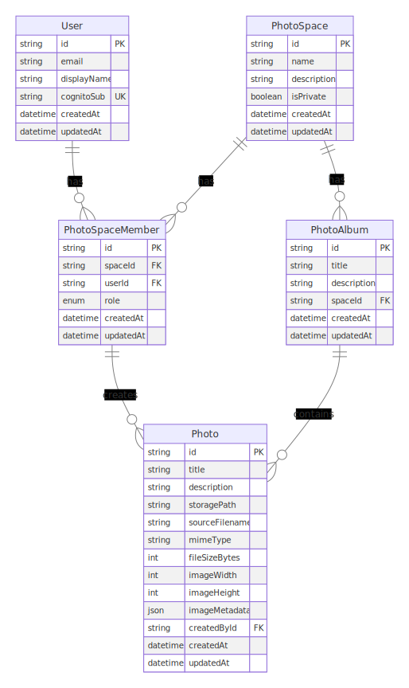

# データベース設計

## ER図

Mermaidソースは[こちら](./diagrams/er.mmd)にあります。

## 主な関係性

1. User - GroupMember
   - 1人のユーザーは複数のグループのメンバーになれる
   - グループメンバーシップは必ずユーザーに紐づく

2. Group - GroupMember
   - 1つのグループは複数のメンバーを持てる
   - グループメンバーシップは必ずグループに紐づく

3. Group - Album
   - 1つのグループは複数のアルバムを持てる
   - アルバムは必ず1つのグループに属する

4. GroupMember - Photo
   - グループメンバーは複数の写真をアップロードできる
   - 写真は必ず1人のアップロード者（GroupMember）に紐づく

5. Album - Photo
   - 1つのアルバムは複数の写真を含むことができる
   - 1つの写真は複数のアルバムに属することができる
